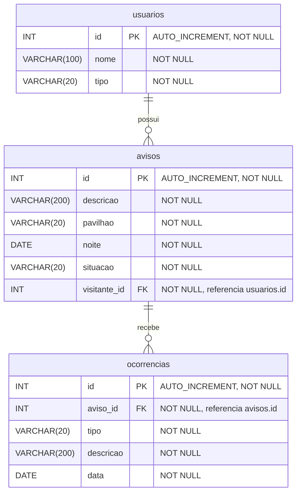

# DER - Cartilha 5: Cadê

Modelo da aula 6. Um visitante possui vários avisos; cada aviso possui várias ocorrências.

## Tipos e restrições

| Coluna | Escolha e motivo |
| --- | --- |
| Todos os `id` | `INT`, chave primária gerada pelo banco; o cliente não escolhe o id. |
| `usuarios.nome` | `VARCHAR(100) NOT NULL`, seguindo o tamanho do exemplo da aula. |
| `usuarios.tipo` | `VARCHAR(20) NOT NULL`; os cadastros iniciais usam `visitante` e `equipe`. |
| As duas descrições | `VARCHAR(200) NOT NULL`, igual ao limite máximo já usado pelo Pydantic. Entrada de 3 a 200 caracteres. |
| `avisos.pavilhao` | `VARCHAR(20) NOT NULL`; o esquema aceita `Pavilhao 1`, `Pavilhao 2` ou `Pavilhao 3`. |
| `avisos.noite` | `DATE NOT NULL`, dia da perda; o JSON continua usando `AAAA-MM-DD`. |
| `avisos.situacao` | `VARCHAR(20) NOT NULL`; o serviço define `procurando`, `aguardando retirada` ou `devolvido`. |
| `avisos.visitante_id` | `INT NOT NULL` com `ForeignKey("usuarios.id")`; a entrada exige valor positivo e o serviço confere se é um visitante cadastrado. |
| `ocorrencias.aviso_id` | `INT NOT NULL` com `ForeignKey("avisos.id")`, a chave da filha para a principal exigida nesta aula. |
| `ocorrencias.tipo` | `VARCHAR(20) NOT NULL`; o esquema aceita `objeto achado` ou `devolucao`. |
| `ocorrencias.data` | `DATE NOT NULL`, definida pelo serviço na data do registro. |

As opções de texto e o tamanho mínimo são validados pelo esquema/serviço; não existem constraints SQL para esses valores. O banco impõe os tamanhos máximos, os campos obrigatórios, as chaves primárias e a chave estrangeira indicada.

As duas relações são físicas: `avisos.visitante_id → usuarios.id` e `ocorrencias.aviso_id → avisos.id`. O serviço ainda confere o tipo `visitante`, porque uma chave estrangeira garante apenas que o usuário existe.

`Aviso.ocorrencias = relationship("Ocorrencia")` oferece acesso aos objetos relacionados no Python. Não cria coluna nem substitui a chave estrangeira.
